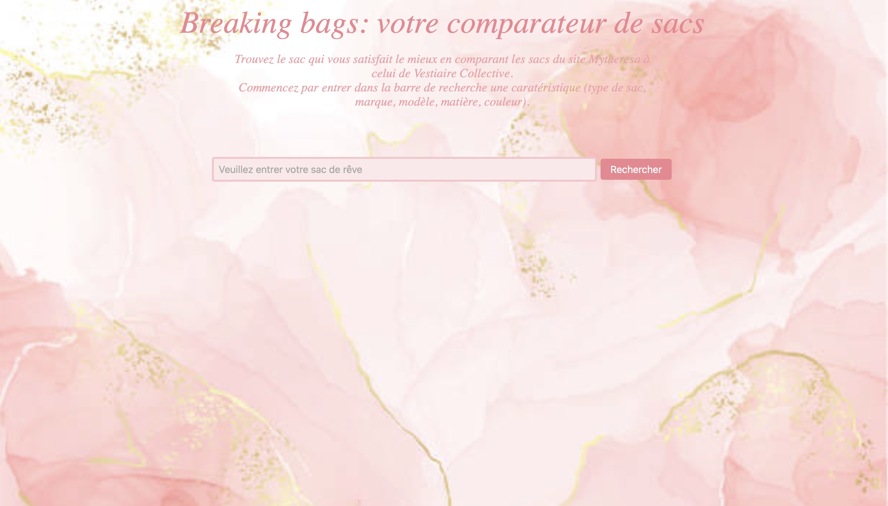
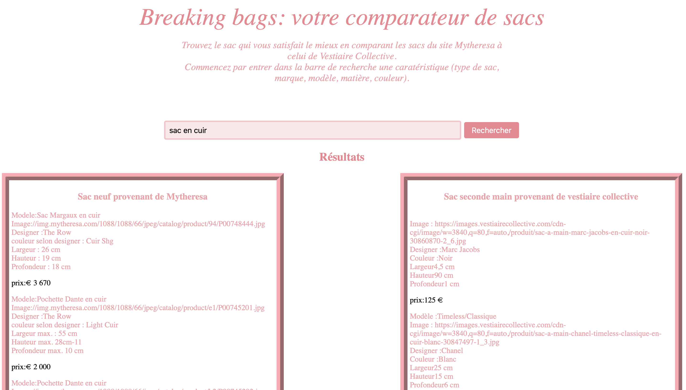
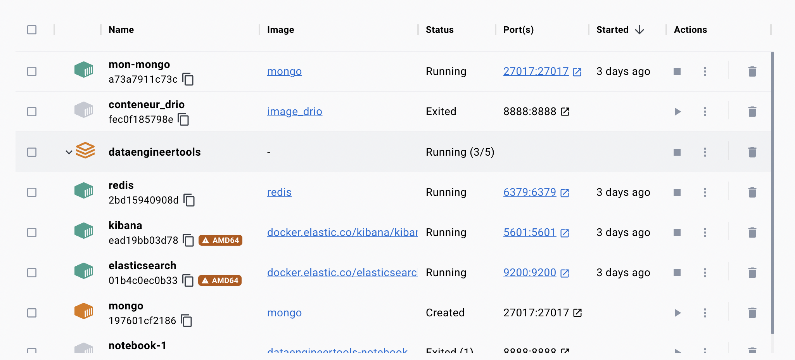
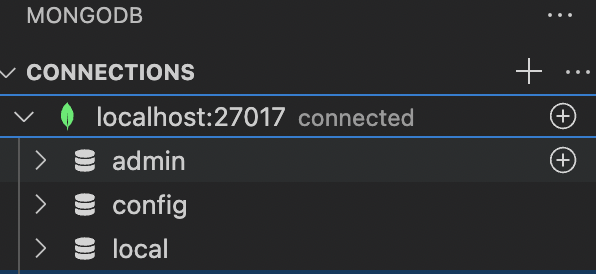
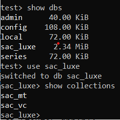
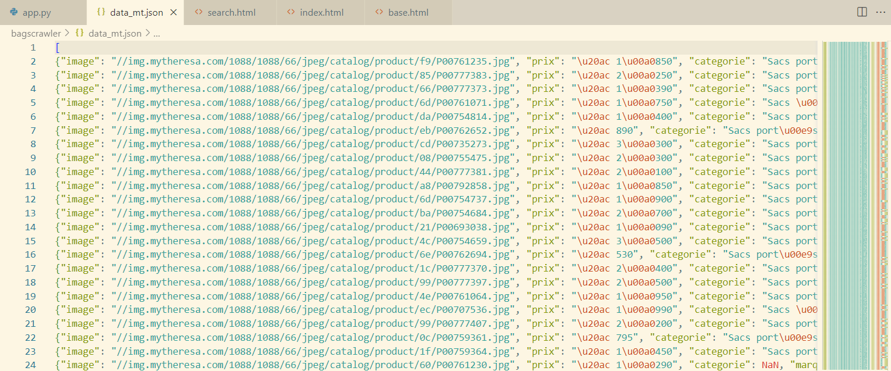
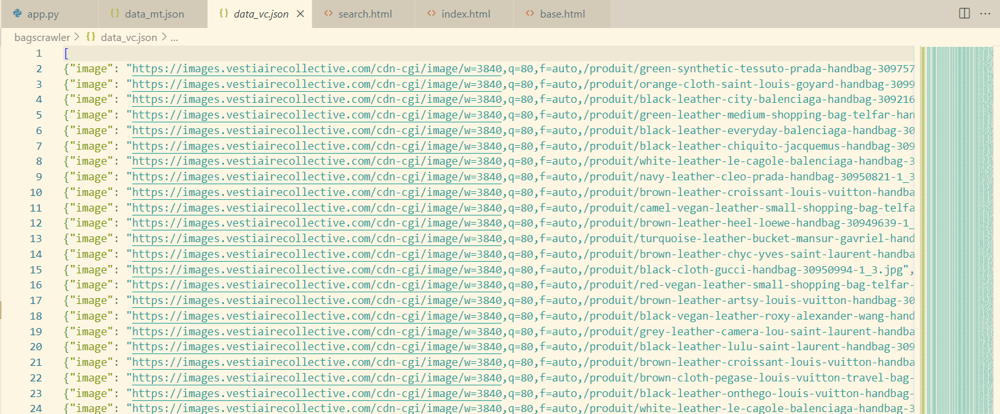

# Projetdataenginnering_sac_luxe


## Introduction

Dans le cadre de l'unité DSIA-4201C : Data engineering, un projet est à réaliser en groupe de 2 ou 3 afin de mettre en oeuvre les notions vues en cours. Ce projet consiste à récupérer des données sur le web puis les afficher de façon optimale ( moteur de recherche, graphiques ... ) en créant une application web basée sur le package Flask.

Membre du groupe : Christine WANG, Evelyne SU et Khalil KABA

Pour ce projet, nous avons décidé de scraper les sacs de luxe pour femmes afin de comparer les sacs neufs et les sac d'occasion. Nous nous sommes concentrés sur deux sites.

Sites webs dynamiques que nous avons scrapés en utilisant selenium et scrapy. 
- [Mytheresa](https://www.mytheresa.com/fr-fr/bags.html)
- [Vestiaire Collective](https://fr.vestiairecollective.com/sacs-femme/#gender=Femme%231)

**Aperçu de la page d'accueil**



**Aperçu d'une recherche**



## Comment lancer le projet ?
Voici les étapes à suivre:

-Cloner le lien de notre git avec la commande suivante : 

 ```
> git clone https://git.esiee.fr/wangch/projet-dataenginneering.git

```
-Ouvrir le dossier **dataenginnering_sac_luxe** dans Visual Studio code.
Vous avez un fichier requirement.txt qui vous indique les packages necessaires pour que le projet fonctionne.
Pour les installer: `pip install -r requirements.txt`.

-Lancer mongoDB dans Docker: pour le lancer il faut aller dans "Containers" puis appuyer sur l'icone flèche de **mon mongo**  qui est dans la colonne "Action".
Une fois lancé , vous allez voir que le status du containeur sera **Running** s'il est bien lancé.



-Téléchager l'extension **MongoDB for VS code** dans Vs Code et connectez vous. Si vous êtes bien connectés vous alleé voir _connected_ à côté de localhost:27017.



Et c'est à partir de maintenant qu'on peut faire entrer nos fichiers json qui vont être crées lors du scraping (**les données vont donc être scraper en direct)**

-Executer les 2 fichiers scraping : vestiaire_scrape et mytheresa_scrape

Explication de la methode de scraping: 

-Les deux sites sont dynamiques ce qui nous obligent des outils adéquats pour les sites dynamiques.

-Nous avons d'abord utilisé selenium pour entrer dans le site et de récupérer tous les liens de toutes les pages, puis on a utilisé scrapy pour récupérer les informations spécifique à chaque sac dans chaque lien.

-Au debut nous avons choisi d'utilisé Beautifulsoup pour scraper les infomations dans le lien mais le temps de scraping etait beaucoup trop long (plus de deux heures ce qui explique le choix d'utliser scrapy qui nous prend moins de 10 min(dépend de votre ordinateur)).

A la fin des deux scraping vous allez voir l'apparition de deux fichiers json:  data_mt et data_vc qui correspondent respectivement aux données de Mytheresa et de Vestiairecollective.

-Executer le fichier mongoDB.py: ce fichier va créer la database sac_luxe et c'est dans cette database qu'on va créer deux collections: sac_mt et sac_vc .

Voici ce que vous obtiendrez :



Dans sac_mt on va inserer le fichier data_mt.json ou les données seront les documents. Et on fait la même chose pour sac_vc avec le fichier data_vc.json.

Aperçu des fichiers data_mt.json et data_vc.json crées :






Puis on a remarque que sac à anses et sac à main présentent le même type de sac donc on a decidé de garder sac à main comme catégorie et changer **sac à anses** en **sac à main**.
Enfin, on a crée les indexes afin d'utiliser le full text search de MongoDB pour monter le moteur de rechercher.


-Lancer le fichier app.py:
vous allez voir que dans le terminale, on va vous fournir un lien il suffit de cliquer pour acceder à l'application flask :"Running on http://127.0.0.1:5000"


## Developer's guide

Eléments présents dans le dépots git :


Pour le scraping: ces deux fichiers vont créer deux fichiers json 

-vestiaire_scrape.py

-mytheresa_scrape.py


Pour MongoDB:

-mongoDB.py

Pour l'application à lancer:

-app.py

-un dossier **templates** (code html du site web):index.html, base.html et search.html

Un dossier **static** (dossier contenant les images qu'on a utilisé pour l'affichage):background.jpeg
[Image](https://www.istockphoto.com/fr/vectoriel/abstrait-rose-blush-fond-aquarelle-liquide-avec-des-lignes-dorées-des-points-et-gm1330963152-414239373)


-On a le README.md qui explique le projet.

-Des images qu'on a utilisé pour le décrire.


## Utilisation de l'application web

L'application web **Breaking Bags** affiche une barre de recherche :

-l'utilisateur peut entrer ses critères: 

-catégorie de sac: Porté main, Sacs Porté Epaule...etc

-couleur

-modele

-marque

-le prix (un prix spécifique à vous)

-Puis il doit appuyer **Rechercher** pour soumettre ses critères.

-On va voir l'affichage de deux colonnes : la colonne gauche représente les sacs neuf qu'on a scrapé sur Mytheresa et la colonne droite représente les sacs seconde main provenant de Vestiairecollective.

## Problèmes rencontrés

Lorsqu'on lance les deux fichiers de scraping mytheresa_scrape et vestiaire_scrape, nous obtenons des resultats très différentes:

Christine (Mac 2022):des fois 48 items dans le json ou alors environs 4800 pour vestiaire collective , et 89 items ou alors des 4020 pour mytheresa.

Evelyne(Acer): elle obtient des resultats très constant 5040 pour vestiaire collective et 4020 pour mytheresa.

On ne sait pas trop la raison.

## Copyright

Nous déclarons sur l'honneur que le code fourni a été produit par nous-mêmes.


